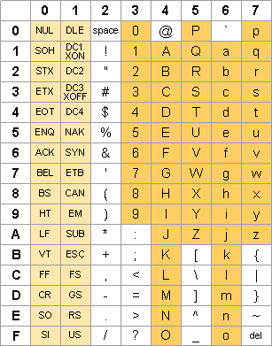

# Number Representation

Topics: Computer Arithmetic

> Reading Materials and Tutoring Online:
>
> [Learn Binary Negative Numbers and 2's Complement](https://ryanstutorials.net/binary-tutorial/binary-negative-numbers.php#converting)
>
> [https://www.cs.cornell.edu/~tomf/notes/cps104/twoscomp.html](https://www.cs.cornell.edu/~tomf/notes/cps104/twoscomp.html)
>
> [1's & 2's Complement Calculator](https://ncalculators.com/digital-computation/1s-2s-complement-calculator.htm)

## 為什麼電腦不用十進位而用二進位？

A: signal 的 voltage 只能分成 high 和 low →→ 只能有兩種state

### **電子電路：**

- switch(n-type transistor):
    - three terminals: the source, the gate, and the drain.
    - 開：
        1. 在 gate加電壓 → 產生 electron channel 在 source 和 drain 之間
        2. 在 source 和 drain 之間加電位差 → 產生電流
    - 關：移除 gate 的電壓

### **數位電子學**

- 有了開關就可以做邏輯閘，e.g. NAND gate，NAND gate 是 function complete ，任何一個 boolean function 都可以用 NAND gate 組合表示出來
- 有了邏輯閘就可以做邏輯電路，也可以做記憶元件

---

## Summary of Terminologies

- **Bit**
    
    - The fundamental unit of memory inside a computer is called a **bit**, which is a contraction of the words *binary digit*.
    - Thus, **a bit is a binary digit**; i.e., a *0* or *1*.
    - Everything is stored on the computer in units of bits.
    - Because most data communications is serial in nature, most data communication and networking services indicate capacity in unit of bits per second; e.g., Ethernet operates at 10 million bits/sec (Mbps).
    - Some communication schemes, such as Fibre Channel, are parallel and describe capacity in terms of bytes/sec. but that is less common.
    
- **Byte**
    - Byte is equivalent to **8 bits**, also called an *octet*.
    - Memory combines individual bits into larger units.
    - Computer media, including memory and disk drives, generally report their size in terms of bytes, such as 256 MB of RAM or a 120 GB hard drive.
    - A byte, historically, is a computer architecture term that refers to **a memory storage of a single character.**
    
- **Radix**

  - The standard digit set used for **radix**-r numbers is {0, 1, . . . , r – 1}. This digit set leads to a unique representation for every natural number. The binary or rdix-2 digit set is {0, 1}
  which is conveniently representable by electronic signals. Typically, low voltage is used to represent 0 and high voltage denotes 1, but the reverse polarity can also be used.
    - Conceptually, the decimal digit values 0 through 9 could be represented by 10 different voltage levels. However, encoding everything with 0s and 1s makes it easier for electronic circuits to interpret and process the information speedily and reliably.
  
- **BCD (Binary-Coded Decimal)**

    One way to encode decimal digits using binary signals is to encode each of the digits 0-9 by means of its **4-bit** binary representation:

    - The use of digit values 0 through r – 1 in radix r is just a convention. We could use more than r digit values (for example, digit values –2 to 2 in radix 4) or use r digit values that do not start with 0 (for example, digit set {–1, 0, 1} in radix 3).

        <div style={{ zoom: 0.50 }} class='text--center'></div>

- **Hexadecimal Notation**
    - Simplifies notation of bit patterns.
    - Much better alternative, compared to binary number notation.
    - Simplifies notation of long binary strings, such as entire blocks of computer memory.
    - Hexadecimal notation is used *mainly for human convinience*.
    
- American Standard Code for Information Interchange (ASCII)
    - ASCII is an 8-bit code with 256 characters
    - An 8-bit byte can accommodate up to 28, or $2^{56}$, characters.

        

    - represents upper- and lower-case letters, numerals, punctuation marks, and other symbols in an 8-bit byte.
    - For example, the 8-bit ASCII codes for the ten decimal digits are of the form 0011xxxx, where the “xxxx” part is identical to the BCD code discussed earlier. ASCII digits take twice as much space as BCD digits and thus are not used in arithmetic units.
    
- **Number**: a number from 0 to 255. But only the numbers 32 to 127 represent "printable characters."

- **Character**:
    - a symbol from the following set, called printable:
    - !"#$%&'()*+,-./0123456789:;<=>?@ABCDEFGHIJKLMNOPQRSTUVWXYZ[\]^_`abcdefghijklmnopqrstuvwxyz{|}~   plus space and delete.
    
- 16-bit Unicode

- **Number Representation**
    - **Unsigned**
        - $[0, 2^{N-1}]$
        - (for N=32, $2^{N - 1} = 4,294,967,295$)
    - **Sign and Magnitude**
        - $[-(2^{N-1}-1), 2^{N-1}-1]$
        - 2 zeros, 0 (1x0000) and +0 (0x0000)
    - **One's Complement**
        - $[-(2^{N-1}-1), 2^{N-1}-1]$
        - 2 zeros
    - **Two's Complement**
        - $[-(2^{N-1}), 2^{N-1}-1]$
        - (for N=32, $2^{N-1} - 1 = 2,147,483,647$)
    - **Biased Encoding**
        - $[\text{bias}, 2^N-1+\text{bias}]$
    
- **Sign and Magnitude**

    - The set { . . . , –3, –2, –1, 0, 1, 2, 3, . . . } of integers is also referred to as signed or directed (whole) numbers. The most straightforward representation of integers consists of
      **attaching a sign bit** to any desired representation of natural numbers, leading to **signed magnitude** representation.

    - The standard convention is to use 0 for positive and 1 for
      negative and attach the sign bit to the left end of the magnitude.

    - The problem with signed magnitude representations is that there are two representations for zero, namely -0 (1x0000) and +0 (0x0000). This makes arithmetic circuits compilcated. Hence, signed magnitude encoding was abandoned early in the development of computer arithmetic.

- **Bias Encoding**

    - Another option for encoding signed integers in the range $[–N, P]$ is the biased representation. If we add the positive value N (the bias) to all numbers in the desired range, unsigned integers in the range $[0, P + N]$ result.

    - Any method for representing natural numbers in $[0, P + N]$ can then be used for representing the original signed integers in $[–N, P]$.

    - *This type of biased representation has only limited application in encoding of the exponents in floating-point numbers.*

- **2's Complement**

    - By far the most common machine encoding of signed integers is the 2’s-complement representation

    - In the k-bit 2’s-complement format, a negative value $–x$, with $x$ > 0, is encoded as the unsigned number $2^k-x$

- **Overflow**

    - Overflow occurs when there are **insufficient bits** in a binary number representation to portray the result of an arithmetic operation. Overflow occurs because computer arithmetic is not closed with respect to addition, subtraction, multiplication, or division. Overflow **cannot** occur in addition (subtraction), if the operands have **different** (resp. identical) signs.

    - To detect and compensate for overflow, one needs n+1 bits if an n-bit number representation is employed. For example, in 32-bit arithmetic, 33 bits are required to detect or compensate for overflow. This can be implemented in addition (subtraction) by letting a carry (borrow) occur into (from) the sign bit.

# Data Input Analog — Digital

1. **Sample**
    - We divide music into tiny intervals, like for a CD, there are 44100s in one second.
    - We ask what the height of the signal is.
2. **Quantize**
    - Then we divide the height into quantized number, dividing up the signal in its aptitude.
    - For every one of these samples, we figure out where, on a 16-bit (65536 tic-mark) "*yarstick*", it lies.

We can also use [hof.povray.org](http://hof.povray.org/) to create beautiful digital pictures

---

## Bit can represent anything

### bit

- a single binary digit, either zero or one.

### byte

- 8 bits, can represent positive numbers from 0 to 255.

### Great Idea

- Computers can only represent numbers in base 2.
- We can use bits to repersent everything:
    - **Characters:**
        - 26 letters → (at least) 5 bits → $2^5$ representations
    - **Upper/lower case, punctuation:**
        - 7 bits (in 8)
        - **ASCII**
            - *Why 7-bits?*

                The original ASCII code provides 128 difference characters has 7 digits. ASCII and 7-bit ASCII are synonymous. Since the 8-bit byte is the common storage element, ASCII leaves room for 128 additional characters, which are used to represent a host of foreign language and other symbols: 

                

            - [ASCII Table](https://www.sciencebuddies.org/science-fair-projects/references/ascii-table)

                [https://www.sciencebuddies.org/science-fair-projects/references/ascii-table](https://www.sciencebuddies.org/science-fair-projects/references/ascii-table)

    - **Unicode — standard code to cover all the world's languagues:**
        - 8, 16, 32 bits
    - **Logical Values**
        - 0 — False
        - 1 — True
    - **Color**
        - Eg. Red(00), Green(01), Blue(11)
    - We can also design it to store other informations, like locations, addresses, commands

### **Key Takeaway**

- $N$ bits ←→ $2^N$ things
    - i.e. If we have $x$ things, we need to take a $log_2$ of that number and ceil it to get the number of bits it needs.
- The number of digits needed to represent $n$ in base $b$
is at least: $log_b(n+1)$

---

# Base Conversion

## Binary, Decimal, Hex


- **Relationship between decimal, hexadecimal and binary**

    [relationship between decimal, hexadecimal and binary](https://www.notion.so/bb87049a052940d1b442f69c60cca337)

- **Representation in base b uses digits:**
    - $\{0, 1, 2, 3, \cdots, b - 1\}$

### **Theorem of converting any base into decimal**

- Fix an integer b > 1. Any nonnegative integer n can be expressed uniquely as:
  $n = a_k·b^k + a_{k-1}·b^{k-1} + …. + a_1·b^1 + a_0·b^0$

- Each $a^j$ is an integer digit in the range $\{0,1,…,b-1\}$ and $a_k≠ 0$.

- **Example:**
  - $(612)_7 = 6·7^2 + 1·7^1 + 2·7^0 = 303$

### Decimal

- To represent the positive integer one hundred and twenty-five as a decimal number, we can write (with the postivie sign implied). The subscript 10 denotes the number as a base 10 (decimal) number:

    $125_{10} = 1\cdot100 + 2\cdot10 + 5\cdot1 = 1\cdot102 + 2\cdot101 + 5\cdot10$

- Tally counting: 监狱里划线计数 → **base 1**
    - When we count it, it's in base 10

### Binary to Decimal/Hexadecimal

1. Left pad zeros until you have groups of 4
2. Convert each group of 4 from binary to hex

- Writing as $0b1101$ or $1101_2$


Imagine there are boxes with numbers indicated number of eggs every box can hold, $1$ means the box is full and $0$ means the box is empty. We can count the number of eggs to convert binary numbers into decimal numbers.

[Copy of The value of bits in hexadecimal numbers](https://www.notion.so/7937e47baa9f4a44a653a0c90e2452fa)

### Hexadecimal

- $\{0, 1, 2, 3, 4, 5, 6, 7, 8, 9, A, B, C, D, E, F\}$
- $A = 10, B = 11, C = 12, D = 13, E = 14, F = 15$
- Writing as $0\text{xA}5$ or $\text{A}5_{16}$
- In this way **a byte can be represented by two hexadecimal digits**

### Decimal to Binary

- Go through columns from left to right
- First, find the leftmost column that has number ≤ number $n$
- Then, if $n$ cannot fill in that box (< that column number), we put a $0$ inside that column
- Repeat the last process for the rest of the columns from left to right

### Decimal to Hexadecimal

- Go through columns from left to right
- First, find the leftmost column that has number ≤ number $n$
- Then, we put **number of columns that can be filled by** $n$, substract **col * number of columns** from $n$
- If not, put $0$ and keep going
- Keep going to the rightmost column

### Binary to Hexadecimal

Memorize the table:

| Hexadecimal | Decimal | Binary |
| ----------- | ------- | ------ |
| 0           | 0       | 0      |
| 1           | 1       | 1      |
| 2           | 2       | 10     |
| 3           | 3       | 11     |
| 4           | 4       | 100    |
| 5           | 5       | 101    |
| 6           | 6       | 110    |
| 7           | 7       | 111    |
| 8           | 8       | 1000   |
| 9           | 9       | 1001   |
| A           | 10      | 1010   |
| B           | 11      | 1011   |
| C           | 12      | 1100   |
| D           | 13      | 1101   |
| E           | 14      | 1110   |
| F           | 15      | 1111   |

- First, go from **right to left**
- We can choose to **left-pad** with $0s$ to make full **4-bits values**, then look up every 4-bits in the table
- Or we can directly convert every 4-bits from **right to left** in the original binary number

### Hexadecimal to Binary

1. Expand each hexadecimal digit to binary digits
2. Remove leftmost (leading) zeros

- 🤣 Joke: *Every Base is Base 10*

    *In the base ten system, the farthest right place is the ones place, the place one to the left is the tens place, one to the left of that is the hundreds (ten squared) place, and so on. In base two, the farthest right place is for ones, the next one to the left is for the twos, the one to the left of that is for fours (two squared), and so on. In base two, the number two is 10.*

    *That’s how bases work in general. In base sixteen, the number sixteen is 10. In base twenty, the number twenty is 10. In base sixty, the number sixty is 10. So “base 10” means absolutely nothing, and I find that hilarious.*

---

## Nibble and Byte

---

### Nibble/4 Bits

- One nibble is 4 bits, half of a byte.
- One **hex digit** = 16 things

### Byte/8 Bits

- One byte is 8 bits
- Two **hex digits** = 256 things
- **RGB Color**
    - Color is usually composed of **6 hex digits (two for each component)**
        1. RED 0-255
        2. GREEN 0-255
        3. BLUE 0-255

---

# Arithematics

We can **add, substract, multiply, divide, compare** them

## Addition

- 0 + 0 = 0
- 0 + 1 = 1
- 1 + 0 = 1
- 1 + 1 = 10 (which is 0 carry 1)
- 1 + 1 + 1 = 11

## Subtraction

- 1 - 1 = 0
- 0 - 1 = 1 (put "-1" to next bit)


3rd bit carry -1, so 减数0被借去1，变成1，1 - 1 = 0, 3rd bit result is 0；0被减去之前要找前面的1借1，所以减数4th bit 1 - 1 = 0，结果为0

### Multiplication

Same procedure for base 10 multiplication

---

# Overflow

When the magnitude of the result is too big to fit into result representation. 

- **Numeral** are **representations** of numbers (an abstraction)
- Digits of **numeral**, not numbers

- There can be overflow only if signs of two numbers are same, and sign of sum is opposite to the signs of numbers.
- When the numeral reaches **maximum or minimum**, adding or subtracting from it will result in **overflow**.
- Overflow errors only occur when the correct result of the addition falls outside the range of $[−(2^{n−1} ), 2^{n−1} − 1]$. Adding numbers of opposite signs will not result in numbers outside of this range.
- In most modern systems, the value doesn't actually overflow into adjacent memory bits but is **wrapped** **around** or truncated using a modulo operation to fit in the variable.
- The most common result of an overflow is that the least significant representable digits of the result are stored; the result is said to wrap around the maximum (i.e. modulo a power of the radix, usually two in modern computers, but sometimes ten or another radix).


## Overflow of Unsigned

- $1 + 255 = 0$
- Handling — modulo power of two

## Overflow of Signed

- undefined behavior

## Overflow in Bias Form

- $1 + 128 = -127$
- The result of addition wraps around, so the result of **adding two numbers** with the **same signs** will have the results in **opposite sign**.

## Overflow in Two's Complement

If 2 Two's Complement numbers are added, and they both have the same sign (both positive or both negative), then overflow occurs if and only if the result has the opposite sign. Overflow never occurs when adding operands with different signs.

## Check for Integer Overflow

### Method 1

```
1)  Calculate sum
2)  If both numbers are positive and sum is negative then return -1
     Else
        If both numbers are negative and sum is positive then return -1
        Else return 0
```

```c
int addOvf(int* result, int a, int b) 
{ 
    *result = a + b; 
    if(a > 0 && b > 0 && *result < 0) 
        return -1; 
    if(a < 0 && b < 0 && *result > 0) 
        return -1; 
    return 0; 
}
```

### Method 2

Thanks to Himanshu Aggarwal for adding this method. This method doesn’t modify *result if there us an overflow.

```c
#include<stdio.h>
#include<limits.h>
#include<stdlib.h>
  
int addOvf(int* result, int a, int b)
{
   if( a > INT_MAX - b)
     return -1;
   else
   {
     *result = a + b;
      return 0;
   }
}
  
int main()
{
  int *res = (int *)malloc(sizeof(int));
  int x = 2147483640;
  int y = 10;
  
  printf("%d", addOvf(res, x, y));
  printf("\n %d", *res);
  getchar();
  return 0;
}
```

---

# Unsigned In C

C: `unsigned int`

C18: `uintN_t` (N is the width of the numeral)

(for N=32, $2^{N - 1} = 4,294,967,295$)

<div style={{ zoom: 0.67 }} class='text--center'></div>

> The same bits can be interpreted in many different ways with the exact same bits! It can be from an unsigned number to a signed number or even a program. It is all dependent on your interpretation.

# Complement the bits

- *Generally, there are two types of complement of Binary number: 1’s complement and 2’s complement.*

### Binary's Sign

- for zero, use all 0's.
- for positive integers, start counting up, with a maximum of 21.

    (number of bits - 1)

- for negative integers, do exactly the same thing, but **switch the role of 0's and 1's** (so instead of starting with 0000, start with 1111 - that's the "complement" part).
- Doing this, the **first bit gets the role of the "sign" bit**, as it can be used to distinguish between nonnegative and negative decimal values. If the most significant bit is 1, then the binary can be said to be negative, where as if the most significant bit (the leftmost) is 0, you can say the decimal value is nonnegative.

## Sign and Magnitude

We use one digit to represent signs:

- **1 → signed -**
- **0 → unsigned +**

This is called **sign and magnitude**

- If we want to represent **negative** numbers, we just need to **flip the sign (complement the most significant figure)**
- Range: $[-(2^{n-1}), 2^{n-1}]$
    - **Example**: 8-bits

If we want to represent a number in n number of bits:

- the **first bit** always represents the sign of the number. i.e. 0 for a positive number and 1 for a negative number.
- **the remaining bits (n-1) represent the magnitude of the number in Binary.**
- ["Sign-magnitude"](https://en.wikipedia.org/wiki/Signed_number_representations#Signed_magnitude_representation) negative numbers just have the sign bit flipped of their positive counterparts, but this approach has to deal with interpreting `1000` (one `1` followed by all `0`s) as "negative zero" which is confusing.

Remember to check whether the length of bits is enough to hold that decimal number, if not, **overflow** will occur.

Remember to pad 0s at the front to make the bit length.

## One's Complement 反码

- To get 1’s complement of a binary number, simply **invert the given number**.
- Range: $[-(2^{n-1}), 2^{n-1}]$
- Positive values in one's complement are the same as unsigned binary or sign-magnitude.
- But for **negative values**, we first represent the value with **positive sign** and then take the **one's complement of it.**
    - **Example:**

    

- **Note**: **positive** number has leading 0s; **negative** number has leading 1s
- ["Ones' complement"](https://en.wikipedia.org/wiki/Ones%27_complement) negative numbers are just the bit-complement of their positive counterparts, which also leads to a confusing **"negative zero"** with `1111` (all ones).

### To Represent Sign

There is no specific bit to represent the sign, but the MSB (Most Significant Bit) can be used to determine the sign of the number. i.e. MSB is 0 if the number is positive and 1 if the number is negative. Binary numbers are used and also a specific bit size is used. (e.g. 8, 16, 32, etc. bits).

1. If the number is positive
    - Convert the number to binary
    - Set the number to specific bit size
2. If the number is negative
    - Convert the number to binary
    - Set the number to specific bit size
    - Get the complement of that value

### Conversion

To form a two's complement number that is negative you simply take the corresponding positive number, invert all the bits, and add 1. 

- **Invert: 0 → 1, 1 → 0**

**Example:** 

- The example below illustrated this by forming the number negative 35 as a two's complement integer:
    - $35_{10} = 0010 0011_2$
    - $\text{invert} \rightarrow 1101 1100_2$
    - $\text{add}\; 1 \rightarrow 1101 1101_2$
    - So 1101 1101 is our **two's complement representation** of -35. We can check this by adding up the contributions from the individual bits:
    $1101 1101_2 = -128 + 64 + 0 + 16 + 8 + 4 + 0 + 1 = -35$

## Shortcomings of One's Complement (Sign & Magnitude)

### Binary Odometer

- We can use five fingers (one hand) to represent binary numerals and count them continuously from 0 to 31:
    <div style={{ zoom: 0.50 }} class='text--center'>
    </div>

    But with signed numbers, we need to reverse the order of counting for the left of the numerals.

    - **Signed binary odometer:** The leftmost bit is used for the sign, which leaves seven bits for the magnitude. The magnitude uses 7-bit unsigned binary, which can represent 010 (as 000 0000) up to 12710 (as 111 1111). The eighth bit makes these positive or negative, resulting in -12710, ... -0, 0, ... 12710.
- Incremet binary odometer sometimes **increase** values, sometimes **decrease** values

    

- There are **two zeros**: — two zeros(00000 and 11111) overlap
    - "minus zero", 1000 0000
    - "plus zero", 0000 0000
- We can simply shift the left odometer by one — there exists a better solution; thus one's complement was **abandoned** eventually. → two's complement

---

# Two's Complement 补码


- Table

    [Table for two’s complement](https://www.notion.so/d1d8a6053a2d4197bf42ffab2924d893)

<div style={{ zoom: 0.67 }} class='text--center'>
</div>

To get 2’s complement of binary number is **1’s complement** of given number **plus 1** to the least significant bit (LSB).

- This representation technique is very much similar to One's Complement Representation. The main difference is that when the number is negative, 1 is added to the LSB (Least Significant Bit) after getting the complement.

    If the number is positive then we may convert the same way we would for [unsigned binary](https://ryanstutorials.net/binary-tutorial/binary-conversions.php#d2b). We must, however, pad out with 0's to the required number of bits. eg. if we are working with 8 bits and we need to represent 6 then:

    - Decimal 6 translates into binary as **110**
    - Padding out this becomes **00000110**
    - $(+25)_{10}$
        - Convert the number to binary -> $(11001)^2$
        - Set the number to specific bit size -> (0001 1001)
    - $(-25)_{10}$
        - Convert the number to binary -> (11001)2
        - Set the number to specific bit size -> (0001 1001)
        - Get the complement of that value -> (1110 0110)
        - Add 1 to LSB -> (1110 0110) + 1 = (1110 0111)

Take one's complement and then add 1 to it. (shift the left odometer by 1)

- Range: $[-(2^{n-1}), 2^{n-1} - 1]$

    **Example:** for 8 bits, $[0b01111111, 0b10000000]$, $[-128, 127]$

    <div style={{ zoom: 0.50 }} class='text--center'></div>

- C99: `intN_t`

- **Example**:

<div style={{ zoom: 0.50 }} class='text--center'></div>

**Example**: flip -3 to 3 to -3 in a nibble

- $2^{N-1}$ non-negatives
- $2^{N-1}$ negatives
- One more negative than positive
- $1$ zero

### Property

Positive (negative) numbers can have infinitely many leading zeroes (ones). Twos complement numbers have some interesting properties, for example, the negation property. Let x' denote the negation of binary number x (e.g., if x = 1010, then x' = 0101). The following assertion holds:

### Advantages

Two's complement numbers are excellent for representing equal number of positive and negative numbers for a fixed number of bits

- Only has one zero
- It simplifies math. Try adding 2 (0010) and -2 (1110) together and you get 10000. The most significant bit is overflow, so the result is actually 0000. Almost like magic, 2 + -2 = 0.

### Overflow

If 2 Two's Complement numbers are added, and they both **have the same sign (both positive or both negative), then overflow occurs if and only if the result has the opposite sign**. Overflow **never** occurs when adding operands with **different signs**.

Overflow occurs when a transition is made

- from $+2^{n−1}-1$ to $−2^{n-1}$ when adding
- from $−2^{n-1}$ to $+2^{n−1}-1$ when subtracting

### Intuitive Understanding


### Converting Two's Complement to Decimal

**Example:** Converting 1111 to decimal:

1. The number starts with 1, so it's negative, so we find the **complement** of 1111, which is 0000.
2. **Add 1** to 0000, and we obtain 0001.
3. **Convert 0001 to decimal**, which is 1.
4. **Apply the sign = -1**

### Range

- Two's complement essentially takes one bit away from the value for use as a sign bit. Since we have one fewer binary digit, the maximum value is 1/2 what it would be for an unsigned number with the same number of bits.

- The largest positive value in N-bit two's complement is 0111...111, which is 2N-1-1.

- The smallest negative value in N-bit two's complement is 1000...000, which is -2N-1.

- **Table 4.4. Two's Complement Integer Ranges**

  [Copy of 2's Complement Bit Range](https://www.notion.so/65ca51ef24e242bb9c2b9f471c0e94bf)

---

 ## Arithmetic

### Addition


**Subtractions by 2’s Complement**

The algorithm to subtract two binary number using 2’s complement is explained as following below −

- Take 2’s complement of the subtrahend
- Add with minuend
- If the result of above addition has **carry bit 1**, then **it is dropped and this result will be positive number.**
- If there is no carry bit 1, then take 2’s complement of the result which will be negative

---

# Biased Encoding

- **For example:** 8 bit, range is $[-127, 128]$
- Bias generally should be $2^{n-1} - 1$ to make number

## 数据类型的大小

**数据类型所占字节数**

**32位和64位下**

- **相同的：**
    - char --1,   short int -- 2,   int -- 4,  unsingned int  -- 4,   float -- 4, double -- 8 , long long 8,
- **不同的：**
    - **32位下：**   char* -- 4 , long -- 4  , unsigned long -- 4
    - **64位下：**   `char*` -- 8 , long -- 8  , unsigned long -- 8

### sizeof 和 strlen 的区别

`sizeof`是**运算符**，它计算的是系统分配的**空间大小**，不是存储数据的大小

`strlen`是**函数**，()里面必须是**字符串指针或者字符串常量**，返回的是`**/0`前面的字符个数。**

**例子**：

```c
char dd[10] = "01234";
NSLog(@"%ld,%ld", sizeof(dd),strlen(dd));
// 输出：10,5
```

```c
char* a = "foobar"; // strlen(a) = 6
char a = 'f'; // segmentation fault -- n/a
char a[] = {'f', 'o', 'o', 'b', 'a', 'r', '\0'}; // 6
char a[] = {'f', 'o', 'o', 'b', 'a', 'r'}; // n/a
char* a = "foo\0bar";
```

### strlen用法

- `char *a = "shd"`
- `len = strlen(a)`
- `len = 0; while (*a++) { len++; }` or `len = 0; while (*a++) { ++len; }`


